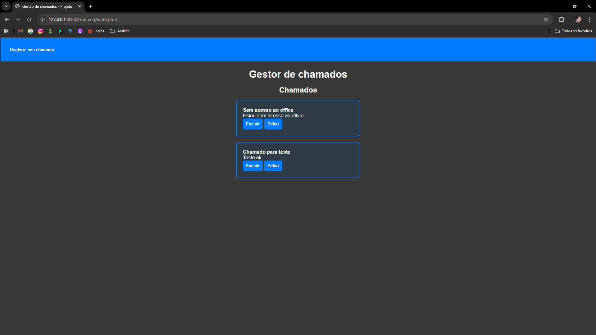
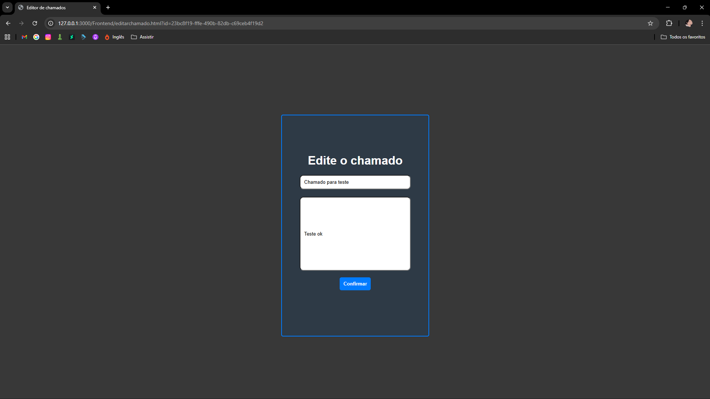

# Sistema-de-chamado
==
Projeto desenvolvido para gestão de chamados técnicos
==
## Técnologias
- Node.js (Criação da API)
- Fastify (Criação do server)
- PostgreSQL (Criação do DB e armazenamento dos dados)
- HTML
- CSS
- JavaScript

## Funcionalidade
- Criar chamados
- Listar ''
- Editar ''
- Excluir ''
- API REST

## Preview

### Dashboard


### Pagina de registro


### Pagina de edição



## Como executar
```bash
npm install
npm run dev
